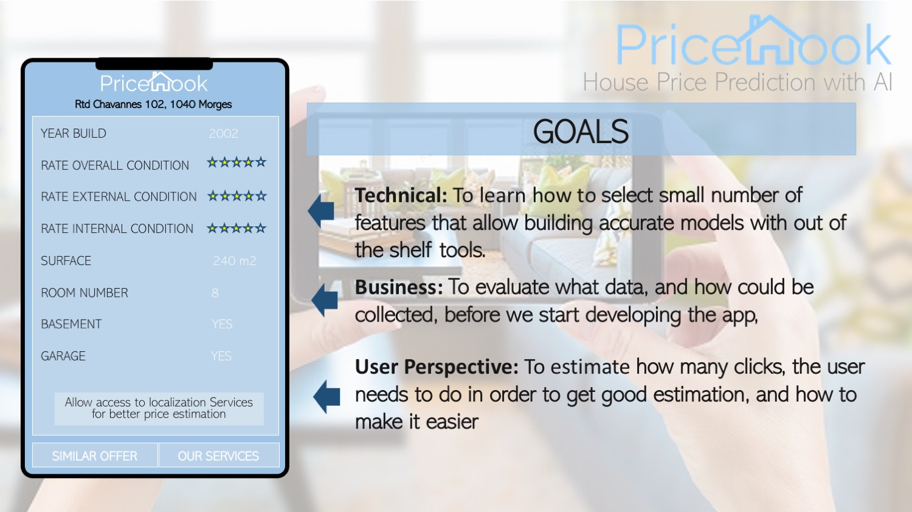

# PriceHook
Build simple yet accurate models to predict house prices with real marker value

__
The goal of this project is to build, simple yet, accurate model predicting house prices, with data that can be obtained with google search.
For this, taks, I will use [Clafornia Housing Prices Dataset from Kaggle](https://www.kaggle.com/camnugent/california-housing-prices)   

__In the first notebook__, I will explore houe price dataset, and I select several features, good predictors for the house price, that are also avaiable with goodle search, or features are easy to verify, by the visitor/home owner, such as number of rooms, and home localization etc.... For, this task I will use, my package called dataFrame explorer, that was created to summarize, explore and clean small and medium size datasets with large number of features and mixed data types. 

__In the second notebook__, I will build model with several different methods using features selected in the first notebook, and compare it to the models build with al avavaible data.   

__Finally, in the third notebook___, I will use my method called __feature select__, to select best set of features from california dataset for optimal model, and I compare its results to results of models build with similar number of features selected using generic methods from sklearn. 

__DATA:__  
[Clafornie Housing Prices](https://www.kaggle.com/camnugent/california-housing-prices)

__MY TOOLS USED IN THIS PROJECT:__  
* __DataFrame Explorer__; my package for vizualization & cleaning of Python dataFrames.
* __Feature select__; a method that I developed, to rank the features, from the most to the least important for regression models.
* __Custom Tranformed function class__; class transfomer developed from scratch for this project
* __additional code;__ all cstom functions used in this project are available under MIT licence, and are in src/utils folder.